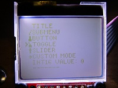
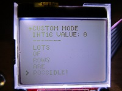
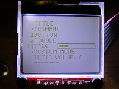
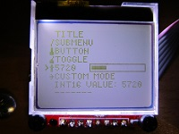

# HX1230Menu
Menu system for HX1230 96x68 LCD screen in PlatformIO STM32 environment.

# Menu items
- Titles
- Submenus (menu tree)
- Toggle switches (binary variable, value is shown by graphics)
- Push buttons (function call)
- Sliders (int16 value with limits and step size)
- Custom mode (execution loop activated through menu)

